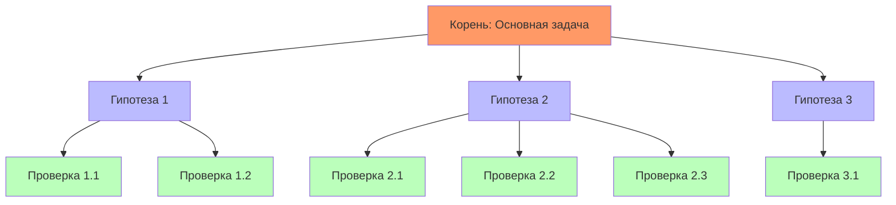
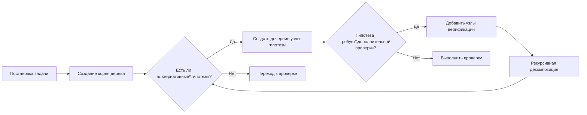
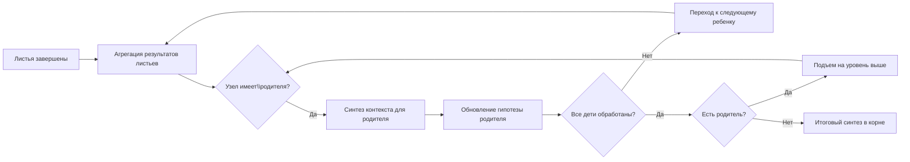

# Архитектура системы глубокого рассуждения на основе дерева гипотез

## Обзор

Система реализует иерархический подход к анализу задач через создание альтернативных ветвей гипотез с восходящим синтезом выводов. Каждый узел дерева представляет гипотезу или подзадачу, где дочерние узлы готовят специфический контекст для родительского уровня.

## Ключевые принципы

### 1. Иерархия альтернативных ветвей
- Корень дерева — основная задача/проблема
- Промежуточные узлы — гипотезы и подзадачи
- Листья — конкретные проверки, сбор данных, эксперименты

### 2. Восходящий синтез (Bottom-Up Aggregation)
- Результаты нижних уровней агрегируются и уточняют верхние узлы
- Каждый уровень передает смысловую нагрузку снизу вверх
- Контекст накапливается по мере подъема к корню

### 3. Обратная рекурсия
- Анализ начинается с декомпозиции задачи (top-down)
- Решение формируется от листьев к корню (bottom-up)
- Верхние узлы уточняются на основе результатов нижних

## Структура дерева



## Компоненты системы

### 1. HypothesisNode (Узел гипотезы)

Каждый узел содержит:

| Поле | Описание |
|------|----------|
| `id` | Уникальный идентификатор узла |
| `type` | Тип узла: root, hypothesis, verification, leaf |
| `description` | Описание гипотезы/задачи |
| `context` | Накопленный контекст для этого узла |
| `children` | Список дочерних узлов |
| `parent_id` | ID родительского узла |
| `status` | Статус: pending, in_progress, completed, rejected |
| `result` | Результат выполнения (для листьев) |
| `confidence` | Уверенность в гипотезе (0-1) |
| `synthesis` | Синтезированный вывод от дочерних узлов |

### 2. TreeManager (Менеджер дерева)

Управляет жизненным циклом дерева:

```python
class TreeManager:
    def create_root(self, task_description: str) -> HypothesisNode
    def add_child(self, parent_id: str, hypothesis: str) -> HypothesisNode
    def set_node_result(self, node_id: str, result: dict) -> None
    def aggregate_upward(self, node_id: str) -> dict
    def get_final_synthesis(self) -> dict
```

### 3. ContextAccumulator (Агрегатор контекста)

Накапливает и передает контекст снизу вверх:

| Метод | Описание |
|-------|----------|
| `collect_from_children(node_id)` | Собирает результаты всех дочерних узлов |
| `synthesize_context(children_results)` | Создает синтезированный контекст |
| `propagate_to_parent(node_id, context)` | Передает контекст родительскому узлу |

## Рабочий процесс

### Фаза 1: Декомпозиция (Top-Down)



### Фаза 2: Восходящий синтез (Bottom-Up)



## Интеграция с агентом

### Новый инструмент: `hypothesis_tree_action`

```python
@tool
def hypothesis_tree_action(
    action: str,           # create_root, add_child, set_result, aggregate, get_synthesis
    node_id: Optional[str],
    description: Optional[str],
    result: Optional[dict]
) -> str:
    """Управление деревом гипотез для глубокого рассуждения."""
```

### Новый скилл: deep-reasoning

Навык описывает методологию работы с деревом гипотез:

1. **Анализ задачи** — создание корня дерева
2. **Генерация гипотез** — добавление дочерних узлов
3. **Декомпозиция** — рекурсивное разложение до проверяемых листьев
4. **Сбор данных** — выполнение проверок в листьях
5. **Восходящий синтез** — агрегация результатов снизу вверх
6. **Формирование вывода** — итоговый отчет из корневого узла

## Пример использования

### Задача: Анализ падения трафика на БС

```
Корень: Почему упал трафик на БС 12345?
├── Гипотеза 1: Технические проблемы
│   ├── Проверка 1.1: cell_availability = 0?
│   ├── Проверка 1.2: Рост RTWP?
│   └── Проверка 1.3: Аномалии в DCR/KPI?
├── Гипотеза 2: Снижение спроса
│   ├── Проверка 2.1: Падение cs_att, ps_att?
│   ├── Проверка 2.2: Уменьшение active_user?
│   └── Проверка 2.3: Сезонные факторы?
└── Гипотеза 3: Внешние факторы
    ├── Проверка 3.1: Изменения в сети?
    └── Проверка 3.2: Конкурирующие БС?
```

### Восходящий синтез

1. **Листья** возвращают результаты проверок (да/нет + метрики)
2. **Гипотеза 1**: 2 из 3 проверок подтверждены → confidence = 0.7
3. **Гипотеза 2**: Все проверки подтверждены → confidence = 0.9
4. **Гипотеза 3**: Нет подтверждений → rejected
5. **Корень**: Основная причина — снижение спроса (confidence 0.9), вторичный фактор — технические проблемы (confidence 0.7)

## Хранение состояния

Дерево сохраняется в `ai_data/hypothesis_trees/<tree_id>.json`:

```json
{
  "id": "tree_20240101_123456",
  "root_description": "Анализ падения трафика БС 12345",
  "created_at": "2024-01-01T12:34:56",
  "nodes": [
    {
      "id": "node_root",
      "type": "root",
      "description": "Анализ падения трафика БС 12345",
      "parent_id": null,
      "children": ["node_h1", "node_h2", "node_h3"],
      "status": "completed",
      "synthesis": {...}
    },
    {
      "id": "node_h1",
      "type": "hypothesis",
      "description": "Технические проблемы",
      "parent_id": "node_root",
      "children": ["node_1.1", "node_1.2", "node_1.3"],
      "status": "completed",
      "confidence": 0.7,
      "synthesis": {...}
    }
  ],
  "final_synthesis": {
    "primary_cause": "Снижение спроса",
    "confidence": 0.9,
    "secondary_causes": ["Технические проблемы"],
    "recommendations": [...]
  }
}
```

## Преимущества подхода

1. **Прозрачность** — видна вся логика анализа и альтернативные пути
2. **Обоснованность** — каждый вывод подкреплен проверками нижних уровней
3. **Гибкость** — возможность добавлять новые гипотезы в процессе анализа
4. **Контекст** — накопление информации от листьев к корню обеспечивает связность
5. **Доверие** — confidence score показывает уверенность в выводах
