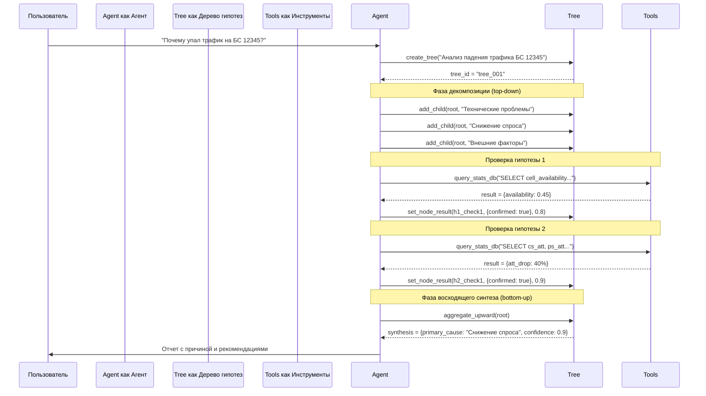

# План реализации системы дерева гипотез

## Обзор задачи

Внедрение системы глубокого рассуждения на основе дерева гипотез с восходящим синтезом выводов в существующего агента.

## Архитектурное решение

### Компоненты для создания

#### 1. Модуль управления деревом (`tools/hypothesis_tree.py`)

**Классы:**
- `NodeType` (enum): root, hypothesis, verification, leaf
- `NodeStatus` (enum): pending, in_progress, completed, rejected
- `HypothesisNode`: данные узла дерева
- `TreeManager`: управление жизненным циклом дерева

**Основные методы TreeManager:**
| Метод | Описание |
|-------|----------|
| `create_tree(task_description)` | Создать дерево с корневым узлом |
| `add_child(parent_id, description, node_type)` | Добавить дочерний узел |
| `set_node_result(node_id, result, confidence)` | Установить результат узла |
| `reject_node(node_id, reason)` | Отклонить гипотезу |
| `aggregate_upward(node_id)` | Агрегировать результаты снизу вверх |
| `get_final_synthesis()` | Получить итоговый синтез из корня |

#### 2. Инструмент для агента (`tools/hypothesis_tree_tool.py`)

**Инструмент: `hypothesis_tree_action`**

```python
@tool
def hypothesis_tree_action(
    action: str,           # create_tree, add_child, set_result, reject, aggregate, get_synthesis, get_status
    tree_id: Optional[str] = None,
    parent_id: Optional[str] = None,
    description: Optional[str] = None,
    result: Optional[dict] = None,
    confidence: Optional[float] = None,
) -> str:
    """Управление деревом гипотез для глубокого рассуждения."""
```

**Возвращаемые значения:**
- При создании дерева: `tree_id`
- При добавлении узла: `node_id` и описание
- При агрегации: синтезированный контекст
- При запросе статуса: прогресс выполнения

#### 3. Скилл deep-reasoning (`skills/deep-reasoning/SKILL.md`)

Навык описывает методологию работы с деревом гипотез:

**Основные инструкции:**
1. **Анализ задачи** — создать корень дерева через `hypothesis_tree_action(action="create_tree")`
2. **Генерация гипотез** — добавить дочерние узлы как альтернативные объяснения/подходы
3. **Декомпозиция** — рекурсивно разложить гипотезы до проверяемых листьев
4. **Сбор данных** — использовать другие инструменты (поиск, SQL-запросы) для проверок в листьях
5. **Установка результатов** — `set_node_result` с подтверждением/опровержением и confidence
6. **Восходящий синтез** — вызвать `aggregate_upward` для автоматической агрегации
7. **Формирование вывода** — получить финальный синтез из корня

#### 4. Обновление агента (`agent.py`)

**Изменения:**
- Добавить импорт `get_tree_manager` и `hypothesis_tree_action`
- Включить инструмент в список инструментов агента
- Обновить системный промпт с инструкциями по использованию дерева гипотез

## Рабочий процесс агента

### Пример: Анализ падения трафика на БС



## Структура данных узла

```json
{
  "id": "node_h1_check2",
  "type": "verification",
  "description": "Рост RTWP указывает на перегрузку/помехи",
  "parent_id": "node_h1",
  "children": [],
  "status": "completed",
  "context": {
    "query": "SELECT AVG(rtwp) FROM hour_stats WHERE cellname = 12345",
    "baseline_avg": 2.1,
    "recent_avg": 5.8
  },
  "result": {
    "confirmed": true,
    "evidence": "RTWP вырос с 2.1 до 5.8 dB"
  },
  "confidence": 0.75,
  "synthesis": null
}
```

## Интеграция с существующими компонентами

### Взаимодействие с субагентами

Дерево гипотез может использовать субагентов для параллельной проверки веток:

```python
# Пример использования
tree_id = hypothesis_tree_action("create_tree", description="Сложный анализ")

# Запустить проверку каждой гипотезы в отдельном субагенте
for hypothesis in hypotheses:
    run_subagent(
        f"Проверь гипотезу: {hypothesis}. Используй дерево {tree_id} "
        f"для записи результатов через hypothesis_tree_action."
    )

# После завершения всех проверок — агрегация
aggregate_result = hypothesis_tree_action("aggregate", tree_id=tree_id)
```

### Взаимодействие с execute_analysis_script

Для сложных вычислений в листьях дерева:

```python
# Генерировать скрипт для проверки гипотезы
script = """
import sqlite3
import pandas as pd

conn = sqlite3.connect(os.environ['DB_PATH'])
df = pd.read_sql_query("SELECT * FROM hour_stats WHERE cellname = 12345", conn)

# Анализ падения трафика
baseline = df[df['dt'] < baseline_date]
recent = df[df['dt'] >= recent_start]

result = {
    'baseline_avg': baseline['ps_traffic'].mean(),
    'recent_avg': recent['ps_traffic'].mean(),
    'drop_percent': (1 - recent['ps_traffic'].mean() / baseline['ps_traffic'].mean()) * 100
}

print(json.dumps(result))
"""

script_result = execute_analysis_script("traffic_drop_check", script)
hypothesis_tree_action("set_result", result=parse_result(script_result), confidence=0.9)
```

## Хранение и управление состоянием

### Путь хранения
- Деревья сохраняются в `ai_data/hypothesis_trees/<tree_id>.json`
- Автоматическое сохранение после каждого изменения узла

### Восстановление состояния
- Агент может загрузить существующее дерево для продолжения работы
- Список деревьев доступен через `list_trees()`

## Обновленный системный промпт агента

```
Ты Deep Agent с поддержкой skills и системы глубокого рассуждения.

## Система дерева гипотез

Для сложных аналитических задач используй дерево гипотез:

1. **Создай дерево** для основной задачи через `hypothesis_tree_action(action="create_tree", description="...")`
2. **Декомпозируй задачу** на альтернативные гипотезы (дочерние узлы корня)
3. **Разложи гипотезы** до проверяемых элементов (листьев)
4. **Собери данные** через другие инструменты для проверок в листьях
5. **Установи результаты** с подтверждением и confidence (0-1)
6. **Выполни агрегацию** снизу вверх через `aggregate_upward`
7. **Получи финальный синтез** из корня дерева

## Правила использования

- Дерево гипотез обязательно для аналитических задач с несколькими возможными причинами/решениями
- Каждая гипотеза должна быть проверяемой (иметь критерии подтверждения/опровержения)
- Confidence должен основываться на численных данных, не спекулировать
- Финальный вывод должен содержать: основную причину, уверенность, вторичные факторы, рекомендации

## Аналитический контракт

1. Сначала создай PLAN в виде дерева гипотез
2. Выполняй проверки по шагам; после каждой — фиксируй результат в дереве
3. Запрещено делать выводы без численного подтверждения (confidence < 0.5 = спекуляция)
4. Анализ завершен только после FINAL_REPORT с синтезом из корня дерева
```

## Этапы реализации

| Этап | Описание | Файлы |
|------|----------|-------|
| 1 | Модуль управления деревом | `tools/hypothesis_tree.py` |
| 2 | Инструмент для агента | `tools/hypothesis_tree_tool.py` |
| 3 | Скилл deep-reasoning | `skills/deep-reasoning/SKILL.md` |
| 4 | Интеграция в агент | `agent.py` (обновление) |
| 5 | Документация и примеры | `ai_doc/hypothesis_tree_usage.md`, `quickstart.md` |

## Тестирование

### Сценарий тестирования

1. Создать дерево с задачей анализа
2. Добавить 3 гипотезы как дочерние узлы
3. Для каждой гипотезы добавить 2-3 проверки (листья)
4. Установить результаты проверок с разными confidence
5. Вызвать агрегацию и проверить синтез
6. Получить финальный отчет

### Ожидаемый результат

- Дерево корректно сохраняется и восстанавливается
- Агрегация правильно вычисляет confidence для гипотез
- Финальный синтез содержит обоснованный вывод с основной причиной
